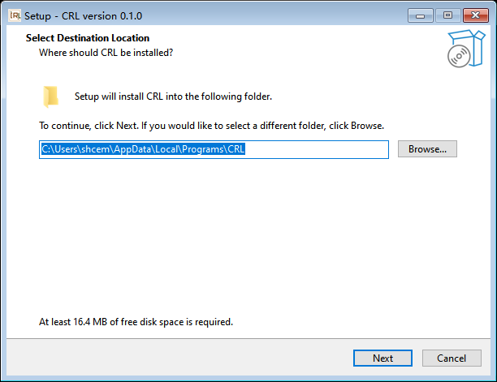
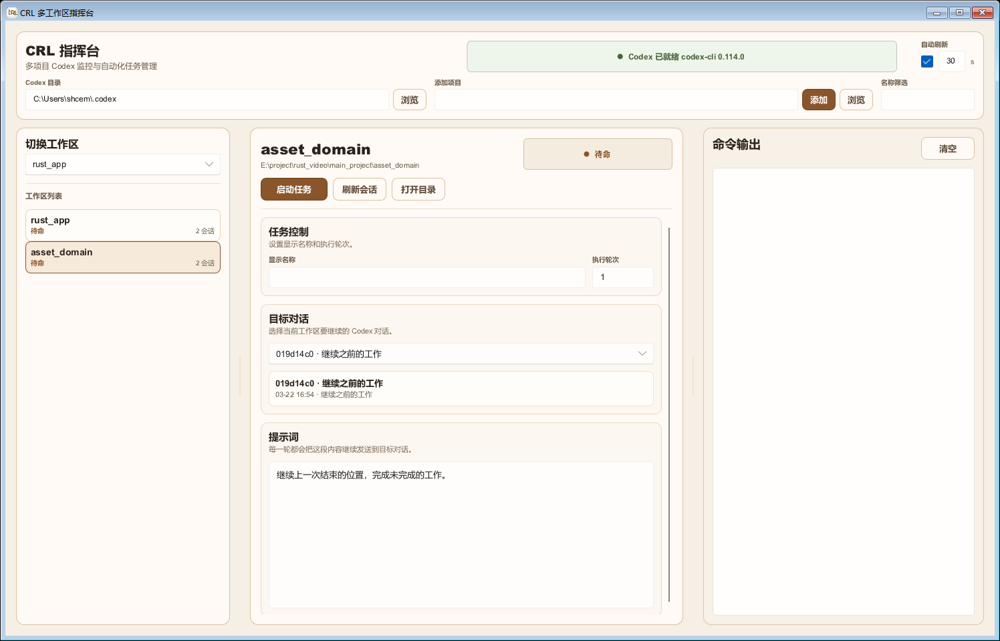

# CRL

CRL 是一个面向 Codex 多工作区协作的工具。

- Windows：桌面 UI + CLI
- Linux：CLI
- iOS：提供 UI + CLI 构建套件，需在 macOS + Xcode 上完成最终构建

它的核心不是“执行一次命令”，而是把同一个 Codex 会话按轮次持续恢复下去，也就是这里说的“重复机制”。

## 依赖

运行依赖：

- `codex` 已安装并且在 PATH 中可执行
- 能访问 `~/.codex`
- Windows 桌面端建议安装 WebView2 Runtime

构建或打包依赖：

- Windows 安装包：Inno Setup 6
- Linux CLI 打包：`zig`、`cargo-zigbuild`
- iOS 构建：macOS、Xcode、`xcrun`、Apple SDK

## 下载地址

- 仓库首页：`https://github.com/noooob-coder/Codex-Resume-Loop`
- Releases 页面：`https://github.com/noooob-coder/Codex-Resume-Loop/releases`

## 发布产物

- Windows 安装包：`crl-setup-windows-x64-0.1.0.exe`
- Linux CLI：`crl-cli-linux-x86_64.tar.gz`
- iOS 构建套件：`crl-ios-ui-and-cli-build-kit.tar.gz`

Windows 版本只保留一个安装包。安装后同时提供：

- 桌面端 `crl-desktop`
- 命令行 `crl`

## Windows 安装与使用

### 安装步骤

1. 打开 Releases 页面。
2. 下载 `crl-setup-windows-x64-0.1.0.exe`。
3. 双击运行安装包。
4. 安装时保持“将 CRL CLI 添加到 PATH”勾选。
5. 安装完成后，重新打开一个新的终端窗口。

安装向导示意：



### 安装后如何验证

先确认命令行已经可以直接使用 `crl`，不需要再加 `cargo run`：

```powershell
crl --help
```

如果这条命令能直接输出帮助信息，说明 PATH 已经生效。

### Windows 常用命令

```powershell
crl --list-sessions
crl 3 "继续上一次结束的位置，完成未完成的工作。"
crl --dry-run 3 "继续上一次结束的位置，完成未完成的工作。"
```

### 如何打开桌面端

安装完成后可以通过两种方式打开：

- 开始菜单中的 `CRL Desktop`
- 安装目录里的 `crl-desktop.exe`

## Linux 安装与使用

### 安装步骤

1. 从 Releases 页面下载 `crl-cli-linux-x86_64.tar.gz`。
2. 解压：

```bash
tar -xzf crl-cli-linux-x86_64.tar.gz
cd <解压目录>
```

3. 执行安装脚本：

```bash
chmod +x install.sh
./install.sh
```

4. 打开一个新的 shell，确认可以直接调用：

```bash
crl --help
```

Linux 发布包的目标也是“安装后直接使用 `crl`”，不是在仓库里继续手动跑 `cargo run`。

### Linux 常用命令

```bash
crl --list-sessions
crl 3 "继续上一次结束的位置，完成未完成的工作。"
crl --dry-run 3 "继续上一次结束的位置，完成未完成的工作。"
```

## iOS 构建与使用

1. 下载 `crl-ios-ui-and-cli-build-kit.tar.gz`
2. 在 macOS 上解压
3. 确认本机已有 Xcode 和 `xcrun`
4. 执行：

```bash
cd <解压目录>
chmod +x packaging/ios/build-ui-and-cli.sh
./packaging/ios/build-ui-and-cli.sh
```

说明：

- 当前 Windows 环境只能准备 iOS 构建套件，不能直接链接出最终 iOS 二进制
- iOS 最终 UI + CLI 产物必须在 macOS 上完成构建

## 桌面端界面

当前版本主界面示意：



界面分区：

- 左栏：工作区列表与切换
- 中栏：任务控制、会话选择、提示词、运行反馈
- 右栏：命令输出

## 重复机制

这是 CRL 最重要的行为。

### 1. 什么叫“重复”

CRL 不会每轮都新开一个全新的任务上下文，而是反复恢复同一个 Codex 会话。

每一轮本质上做的是：

```text
codex exec resume --skip-git-repo-check <session_id> <wrapped_prompt>
```

也就是说：

- 目标会话固定
- 提示词固定
- 按“执行轮次”重复恢复同一个会话

### 2. 桌面端里哪些字段决定重复行为

中间栏里最关键的是这三个输入：

- `目标对话`
  说明：决定恢复哪一个 Codex 会话
- `执行轮次`
  说明：决定总共重复多少轮
- `提示词`
  说明：每一轮都会继续发送到同一个目标会话

举例：

- 目标对话：`session-a`
- 执行轮次：`3`
- 提示词：`继续上一次结束的位置，完成未完成的工作。`

那么 CRL 会对同一个 `session-a` 连续执行 3 轮恢复，而不是 3 个不同会话。

### 3. CLI 里如何表达重复

CLI 的轮次参数就是重复次数：

```bash
crl 3 "继续上一次结束的位置，完成未完成的工作。"
```

这里的 `3` 就表示重复 3 轮。

### 4. 每一轮发送的提示词并不是原样裸发

代码里会把你的原始提示词包装成一个更严格的恢复提示：

- 要求从上一次停止的位置继续
- 要求不要询问“是否继续”
- 要求完成后自检是否还有遗漏
- 只有遇到真实阻塞才允许提前停

所以重复机制不是简单 for-loop，而是“带执行约束的会话恢复循环”。

### 5. 默认轮次

当前默认轮次是 `1`。

也就是说，如果你不主动把轮次改大，CRL 只会恢复一轮。

### 6. 一轮失败后会发生什么

当前版本不会因为其中一轮失败就立刻放弃后续轮次。

实际行为是：

- 某一轮失败时，记录失败轮次和退出码
- 继续尝试后面的轮次
- 所有轮次结束后，再统一汇总失败情况

这意味着重复机制更偏“把计划轮次全部尝试完”，而不是“遇到第一次失败立即中断”。

### 7. 命令输出为什么现在是实时的

输出区现在按数据块实时转发，不再等一整行或一整阶段结束才显示。

这对重复机制很重要，因为你能在每一轮执行过程中立刻看到：

- 当前轮开始了没有
- Codex 是否已经在输出内容
- 某一轮是不是卡住
- 某一轮是不是已经失败并进入下一轮

### 8. 什么场景适合把轮次调大

适合调大轮次的情况：

- 任务规模大，一轮不一定做完
- 你明确希望它持续推进同一个目标会话
- 你希望它即使中间某轮失败，也尽量把后续轮次跑完

不适合盲目调大的情况：

- 提示词本身不稳定
- 当前会话上下文已经偏离目标
- 你还没有确认目标会话选对

## CLI 怎么用

列出当前目录可恢复的会话：

```bash
crl --list-sessions
```

执行指定轮次：

```bash
crl 3 "继续上一次结束的位置，完成未完成的工作。"
```

只看计划：

```bash
crl --dry-run 3 "继续上一次结束的位置，完成未完成的工作。"
```

## 项目组成

- `src/desktop.rs`：桌面控制器
- `src/codex.rs`：Codex 启动、会话发现、恢复提示词构造
- `src/runtime.rs`：后台运行时与实时输出
- `src/model.rs`：状态模型
- `src/persistence.rs`：本地状态持久化
- `src/bin/crl.rs`：CLI 入口
- `ui/main.slint`：桌面 UI
- `packaging/windows`：Windows 安装包脚本
- `packaging/linux`：Linux CLI 打包脚本
- `packaging/ios`：iOS 构建脚本和说明

## 开发检查

```powershell
cargo test
cargo check
```
